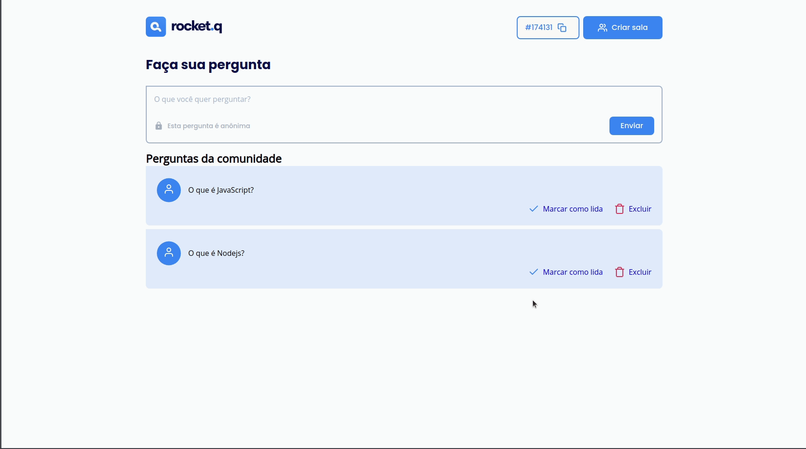
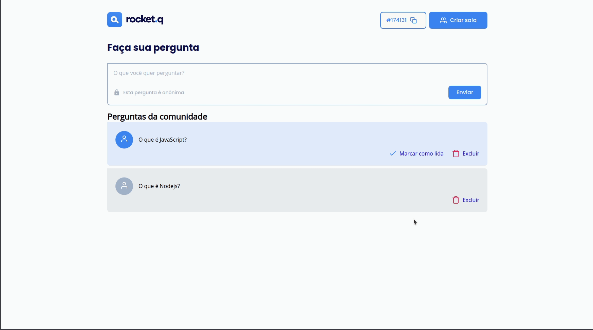
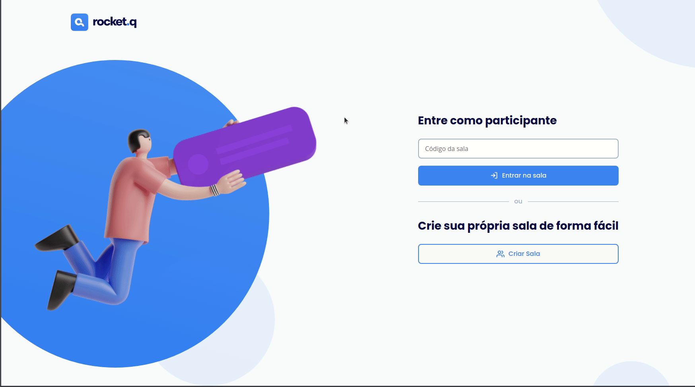

<h1 align="center">
  
</h1>

  <a href="#-projeto">Projeto</a>&nbsp;&nbsp;&nbsp;|&nbsp;&nbsp;&nbsp;
  <a href="#-tecnologias">Tecnologias</a>&nbsp;&nbsp;&nbsp;|&nbsp;&nbsp;&nbsp;
  <a href="#-instalação">Instalação</a>&nbsp;&nbsp;&nbsp;|&nbsp;&nbsp;&nbsp;
  <a href="#atom-features">Features</a>&nbsp;&nbsp;&nbsp;|&nbsp;&nbsp;&nbsp;
  <a href="#-layout">Layout</a>&nbsp;&nbsp;&nbsp;|&nbsp;&nbsp;&nbsp;
  <a href="#memo-licença">Licença</a>

 

  

 

  

## 💻 Projeto

O Rocket.Q é uma aplicação de interação através de perguntas, sendo possível criar uma sala para internautas anônimos fazerem perguntas e o criador da sala em posse de uma senha gerenciar essas perguntas e marcar como lidas.

<h3 align="center">Criando uma sala</h3>

  

<h3 align="center">Criando perguntas</h3>

  

<h3 align="center">Marcar uma pergunta como lida</h3>

  

<h3 align="center">Deletar uma pergunta</h3>

  

<h3 align="center">Entrar em uma sala existente</h3>

  

## 🚀 Tecnologias

  
  
  
  

Esse projeto foi desenvolvido com as seguintes tecnologias:

- HTML
- CSS
- JavaScript
- NodeJS
- EJS
- Express
- SQLite

## 🤖 Instalação

    # Clonar o repositório
    $ git clone https://github.com/jonbrand/rocket.q

    # Entrar na pasta da aplicação
    $ cd rocketq

    # Instalar as dependências
    $ npm install
    
    # Iniciar o banco de dados
    $ npm run init-db

    # Iniciar o servidor
    $ npm start

## :atom: Features
- [ ] Dark mode;
- [ ] Deletar sala;
- [ ] Sair da sala;

## 🎨 Layout

Você pode visualizar o layout do projeto através [desse link](https://www.figma.com/file/vp3iFfd1ohCbHyDX9jCiQi/Roquet.q). É necessário ter conta no [Figma](https://figma.com) para acessá-lo.

## :memo: Licença

Esse projeto está sob a licença MIT. Veja o arquivo [LICENSE](.github/LICENSE.md) para mais detalhes.

---

  

